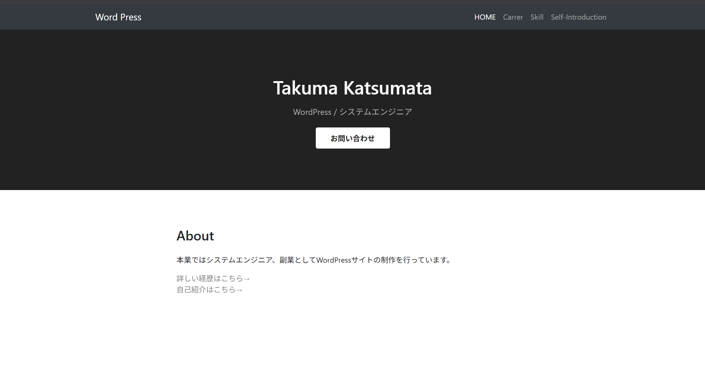
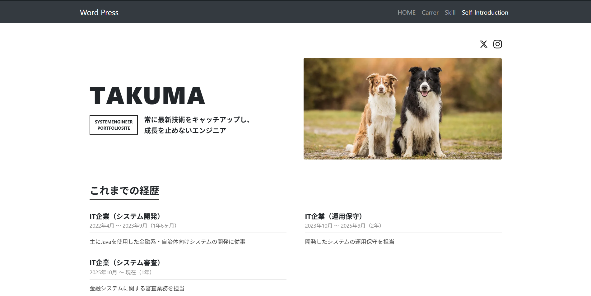

# Takuma's Portfolio

WordPress（[Understrap](https://github.com/understrap/understrap)テーマをベースにカスタマイズ）で構築した、エンジニアとしてのポートフォリオサイトです。

> 🔗 公開URL: <!-- ここに公開後のURLを記載 -->

## スクリーンショット




## About

本業ではシステムエンジニア、副業としてWordPressサイトの制作を行っています。
常に最新技術をキャッチアップし、成長を止めないことをモットーに活動しています。

## 主な機能・ページ構成

| ページ | 内容 |
|---|---|
| トップページ | Hero / About / Skills / Contact / SNSリンクを1ページにまとめた構成 |
| 自己紹介ページ (`/self-introduction/`) | キャッチコピー・経歴をまとめたポートフォリオ用ページ |
| 経歴ページ (`/carrer/`) | これまでの経歴詳細 |
| 実績一覧ページ (`/works/`) | カスタム投稿タイプ「Works」による制作実績の一覧（ナビゲーションメニューにカスタムリンクとして追加） |
| 実績詳細ページ (`/works/{slug}/`) | 使用技術・制作年・デモURLを表示し、デモページへ遷移 |

### カスタム投稿タイプ「Works」

- 投稿タイプ: `works` / タクソノミー: `works_category`（ジャンル）
- カスタムフィールド: 使用技術・制作年・デモURL
- 実装ファイル: `wp-content/themes/understrap/inc/works-post-type.php`、`archive-works.php`、`single-works.php`

### 実装したアニメーション

- **ローディング画面**: ページ初回表示時に「Takuma's Portfolio」のロゴをフェード表示してからコンテンツへ遷移
- **スクロール連動フェードイン**: `IntersectionObserver`を使い、各セクションが画面内に入ると左から右へフェードインしながら表示
- **タイピング風テキスト表示**: 見出しの文字を1文字ずつ左から右へ表示するアニメーション（自己紹介ページ）
- **フェードアップ表示**: キャッチコピー・写真・経歴セクションを下からふわっと表示

## 技術スタック

- WordPress
- PHP
- Understrap（Bootstrapベースのテーマフレームワーク）
- HTML / CSS / JavaScript（Vanilla JS, CSS Animation / `IntersectionObserver`）
- Contact Form 7（お問い合わせフォーム）

## ディレクトリ構成（管理対象）

```
wp-content/themes/understrap/   ... カスタムテーマ本体
  ├ front-page.php              ... トップページ
  ├ page-self-introduction.php  ... 自己紹介ページ用テンプレート
  ├ header.php / footer.php     ... 共通レイアウト・ローディング画面
```

## ローカル環境での動作確認

[Local](https://localwp.com/) (Local by Flywheel) を使用してWordPress環境を構築しています。

1. リポジトリをclone
2. WordPress本体・データベースをセットアップ（`wp-config.php`はリポジトリに含まれません）
3. `wp-content/themes/understrap`を有効化
4. 固定ページ「Self-Introduction」のテンプレートを「Self Introduction」に設定

## Contact

<!-- お問い合わせ先・SNSリンクなどを記載 -->
