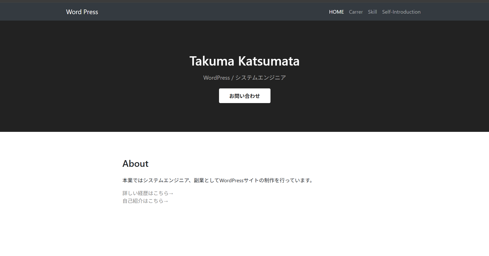
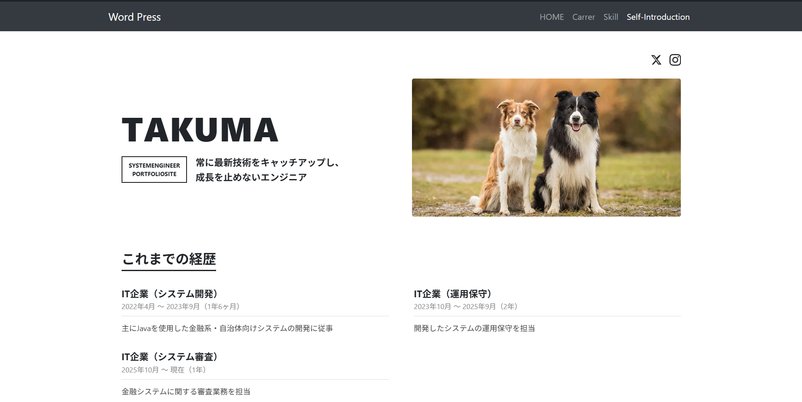

# Takuma's Portfolio

システムエンジニアとして働きながら、副業でWordPressサイト制作を行っている Takuma の**ポートフォリオサイト**です。
自己紹介・経歴・スキル・制作実績をまとめ、お問い合わせも受け付けています。

WordPress の [Understrap](https://github.com/understrap/understrap) テーマをベースに、実績一覧やアニメーションなどを自作して構築しました。

🌐 **公開サイト: https://takuma-dev.infinityfree.me/**



---

## このサイトでできること・見られるもの

初めてご覧になる方は、次の順番で見ていただくと全体像がつかめます。

| ページ | 内容 | リンク |
|---|---|---|
| トップページ | 名前・肩書き、About、スキル、お問い合わせフォーム、SNSリンクを1ページにまとめたページ | [開く](https://takuma-dev.infinityfree.me/) |
| 自己紹介 | キャッチコピーと経歴をまとめたページ | [開く](https://takuma-dev.infinityfree.me/self-introduction/) |
| 経歴 | これまでの経歴の詳細 | [開く](https://takuma-dev.infinityfree.me/carrer/) |
| 制作実績（Works） | 制作したサイトの一覧。各実績に使用技術・制作年・デモを掲載 | [開く](https://takuma-dev.infinityfree.me/works/) |
| デモ: コーポレートサイト | 日本の企業サイトを想定して作った、サンプル（架空の内容）のデモページ | [開く](https://takuma-dev.infinityfree.me/%E3%82%B3%E3%83%BC%E3%83%9D%E3%83%AC%E3%83%BC%E3%83%88%E3%82%B5%E3%82%A4%E3%83%88/) |



---

## 作った人について

本業ではシステムエンジニア（Java / Spring Boot / MySQL / React を使ったサイトの運用保守・障害対応）、
副業として WordPress サイトの制作を行っています。
常に最新技術をキャッチアップし、成長を止めないことをモットーに活動しています。

---

## 見どころ

### 1. 制作実績を管理できる仕組み（カスタム投稿タイプ「Works」）

実績を、通常の投稿とは別の種類として管理画面から登録できるように自作しました。

- 投稿タイプ: `works` / ジャンル分けのタクソノミー: `works_category`
- 実績ごとに、使用技術・制作年・デモURLを入力できるカスタムフィールド
- 一覧ページと詳細ページ（詳細からデモページへ遷移）
- 実装: `wp-content/themes/understrap/inc/works-post-type.php`、`archive-works.php`、`single-works.php`

### 2. 画面の動き（アニメーション）

ライブラリに頼らず、JavaScript と CSS だけで実装しています。

- **ローディング画面**: 初回表示時に「Takuma's Portfolio」のロゴをフェード表示してからコンテンツへ遷移
- **スクロール連動フェードイン**: `IntersectionObserver` で、各セクションが画面内に入ると左からフェードイン（OSの「視差効果を減らす」設定にも対応）
- **タイピング風テキスト**: 見出しを1文字ずつ左から表示（自己紹介ページ）
- **フェードアップ**: キャッチコピー・写真・経歴セクションを下からふわっと表示

### 3. お問い合わせフォーム

トップページに、Contact Form 7 のお問い合わせフォームを設置しています。

---

## 技術スタック

| 分類 | 使用技術 |
|---|---|
| CMS・言語 | WordPress、PHP |
| テーマ | Understrap（Bootstrap ベースのテーマフレームワーク）をカスタマイズ |
| フロントエンド | HTML / CSS / JavaScript（Vanilla JS、CSS Animation、`IntersectionObserver`） |
| プラグイン | Contact Form 7（お問い合わせフォーム） |
| ホスティング | InfinityFree（無料ホスティング） |
| デプロイ | GitHub Actions（`main` へのマージで本番へ自動反映） |
| ローカル開発 | [Local](https://localwp.com/)（Local by Flywheel） |

---

## 開発・運用の仕組み

### デプロイ（本番への反映）

```
ローカルで修正 → feature ブランチに push → Pull Request → main にマージ → GitHub Actions が自動で本番へ反映
```

- `main` ブランチへのマージをきっかけに、FTP で本番の `/htdocs/` へ転送します（[workflow](.github/workflows/deploy.yml)）
- コード・デザインは Git で管理し、固定ページや投稿などの**コンテンツは本番の管理画面から直接編集**します（デプロイでコンテンツが上書きされないようにするため）
- `wp-config.php` などの機密情報はリポジトリに含めず、FTP の認証情報は GitHub Secrets で管理しています

### ディレクトリ構成（管理対象）

```
.github/workflows/deploy.yml    ... 自動デプロイの設定
wp-content/themes/understrap/   ... カスタムテーマ本体
  ├ front-page.php              ... トップページ
  ├ page-self-introduction.php  ... 自己紹介ページ用テンプレート
  ├ page-demo-corporate.php     ... デモ：コーポレートサイト
  ├ archive-works.php           ... 実績一覧ページ
  ├ single-works.php            ... 実績詳細ページ
  ├ header.php / footer.php     ... 共通レイアウト・ローディング画面
  └ inc/
      └ works-post-type.php     ... カスタム投稿タイプ・タクソノミー・カスタムフィールドの登録
docs/                           ... スクリーンショットなどの資料
```

---

## ローカル環境で動かす

[Local](https://localwp.com/)（Local by Flywheel）で WordPress 環境を構築しています。

1. リポジトリを clone
2. WordPress 本体・データベースをセットアップ（`wp-config.php` はリポジトリに含まれません）
3. `wp-content/themes/understrap` を有効化
4. 固定ページ「Self-Introduction」のテンプレートを「Self Introduction」に設定
5. WordPress 管理画面 → 設定 → パーマリンク設定 → 変更を保存（カスタム投稿タイプの URL を有効化）
